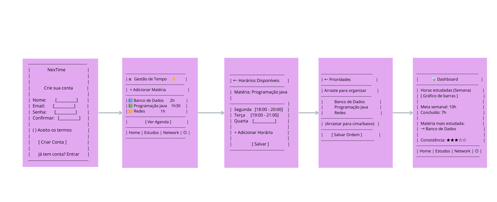
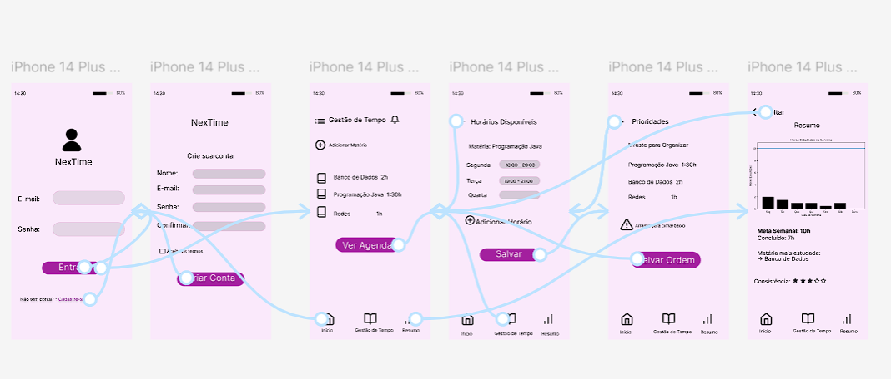

# UX Case Study – Productivity App

## Visão Geral

Este projeto apresenta um estudo de caso de UX focado no desenvolvimento de um aplicativo de produtividade que ajuda usuários a organizar tarefas e melhorar o foco durante os estudos ou trabalho.

---

## Problema

Muitos estudantes e profissionais têm dificuldade em organizar suas tarefas diárias e manter a produtividade. A falta de ferramentas simples e intuitivas pode gerar desorganização e perda de foco.

---

## Objetivo

Desenvolver um aplicativo simples e intuitivo que permita aos usuários:

- organizar tarefas
- acompanhar atividades do dia
- melhorar a produtividade

---

## Pesquisa com Usuários

Para entender melhor o problema, foram realizadas entrevistas com usuários que relataram dificuldades em:

- organizar tarefas
- lembrar atividades importantes
- manter foco durante o dia

### Principais Insights

- usuários preferem interfaces simples
- excesso de funcionalidades gera confusão
- tarefas precisam ser fáceis de adicionar e visualizar

---

## Persona

**Nome:** Ana  
**Idade:** 22 anos  
**Perfil:** Estudante universitária  

**Necessidades**
- organizar tarefas de estudo
- acompanhar atividades do dia
- manter foco

**Dores**
- esquecer tarefas importantes
- dificuldade em organizar o tempo

---

## Wireframes

Nesta etapa foram criados wireframes para estruturar as principais telas do aplicativo.

---

## Protótipo

O protótipo foi desenvolvido utilizando **Figma** para simular a navegação do aplicativo.

O protótipo interativo pode ser acessado no link abaixo:

[Ver protótipo no Figma](https://www.figma.com/proto/D9Bx8aOpW1zOGKkOL3GBjs/NexTime?node-id=1-3&t=csm9Kgy1dn9pvpso-1)

---

## Testes de Usabilidade

O protótipo foi testado com usuários para avaliar:

- facilidade de navegação
- clareza da interface
- entendimento das funcionalidades

### Resultados

Os testes indicaram que os usuários conseguiram navegar pelo aplicativo com facilidade, mas sugeriram melhorias na organização dos botões e na visibilidade das tarefas.

---

## Conclusão

O projeto demonstrou a importância de interfaces simples e focadas nas necessidades do usuário. O processo de pesquisa e testes permitiu identificar melhorias importantes para tornar a experiência mais intuitiva.

---

## Ferramentas Utilizadas

- Figma
- Pesquisa com usuários
- Prototipação
- Testes de usabilidade
